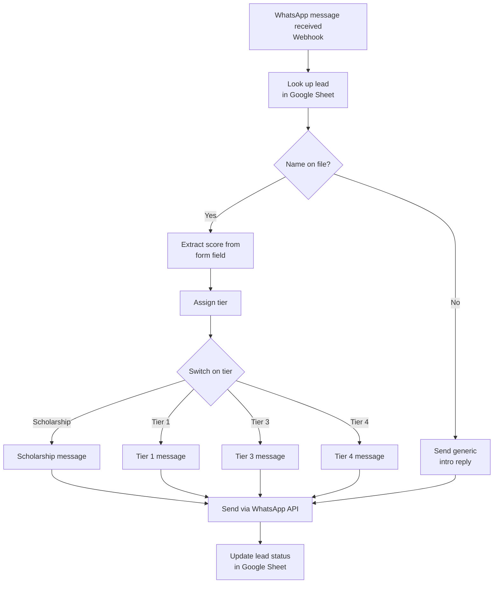

# WhatsApp Lead Auto-Responder (n8n)

An automated workflow that responds to inbound WhatsApp leads in real time, looks up their academic profile in a Google Sheet, scores them into a tier, and sends a personalized reply — all without a human touching the conversation.

Originally built for an education consulting business (student applications to German universities), but the pattern generalizes to **any lead-qualification + auto-response use case**: real estate, insurance, coaching, recruitment, etc.

## What it does

1. **Receives** an inbound WhatsApp message via a webhook (WhatsApp Business API through [YCloud](https://www.ycloud.com/)).
2. **Looks up** the sender's phone number in a Google Sheet of form submissions/leads.
3. **Extracts** a numeric score (e.g. CGPA) from a free-text form field using regex.
4. **Classifies** the lead into a tier (Scholarship / Tier 1 / Tier 3 / Tier 4 / no match) based on that score.
5. **Generates a tailored message** for each tier — different tone, different value proposition, different call-to-action.
6. **Sends the reply** back to the lead over WhatsApp automatically.
7. **Logs the outcome** back to the Google Sheet so the team has a record of what was sent and when.

## Flow diagram

## Why this matters (for clients evaluating this)

- **Zero response lag** — leads get a reply within seconds of messaging, instead of waiting for a human to check WhatsApp.
- **Consistent qualification logic** — every lead is scored the same way, no human judgment inconsistency.
- **Personalized at scale** — each tier gets a message written for its specific situation, not a generic template.
- **Full audit trail** — every interaction is logged back to the sheet automatically.
- **Easy to adapt** — swap the scoring logic, the tiers, or the message copy for any other lead-qualification scenario.

## Tech stack

| Component | Tool |
|---|---|
| Workflow engine | [n8n](https://n8n.io/) (self-hosted or cloud) |
| Messaging channel | WhatsApp Business API via [YCloud](https://www.ycloud.com/) |
| Data store | Google Sheets |
| Logic | JavaScript expressions (regex extraction, tiering) inside n8n Set/Switch nodes |

## Setup

1. Import `WhatsApp_Auto_Responder.json` into your n8n instance (Workflows → Import from File).
2. Connect your own credentials:
   - **Google Sheets OAuth2** — point it at your own leads spreadsheet.
   - **HTTP Header Auth** — set this to your YCloud (or other WhatsApp provider) API key.
3. Replace the placeholders in the workflow:
   - `YOUR_GOOGLE_SHEET_ID` → your Google Sheet's document ID.
   - `YOUR_WHATSAPP_BUSINESS_NUMBER` → your registered WhatsApp Business number.
4. Point your WhatsApp provider's inbound webhook at the n8n Webhook node's URL.
5. Adjust the tiering thresholds and message copy in the Set nodes to match your own qualification criteria.

## Notes

This export has been sanitized — the original sheet ID, sheet name, and business phone number have been replaced with placeholders. Credential references (IDs shown in the JSON) are internal n8n pointers and are not usable outside the original n8n instance.
